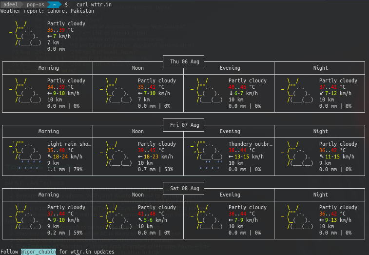
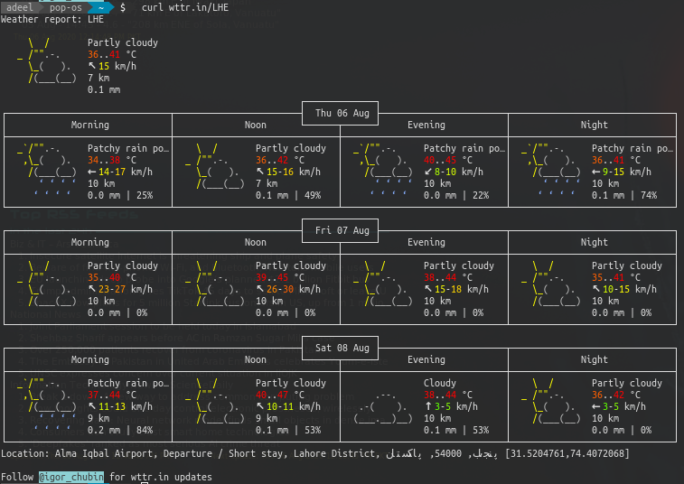

# Command-line (CLI/Terminal) Applications


## Document Processing

### Readable/Printable documents

#### Create pdf document from image files

You can use `imagemagick` to convert image(s) to a pdf file

```sh
convert image1.jpg image2.png image3.bmp output.pdf
```

By default writing documents like `ps`, `pdf`, `eps`, etc. is disabled in the config file `/etc/ImageMagick-6/policy.xml`. This is fixed in version 9.25. If you have an older version installed, you should add line as follows to the `policy.xml` file:

```xml
<policy domain="coder" rights="read|write" pattern="{PS,PDF,XPS}" />
```

#### LibreOffice CLI `lowriter` for PDF conversion

LibreOffice Write provides a cli interface to its PDF converter as:

```sh
# convert to pdf
lowriter --convert-to pdf filename.doc
# batch convert
lowriter --convert-to pdf *.docx
```

Use LibreOffice API to convert file format via `soffice` command:

```sh
soffice --headless --convert-to pdf mySlides.odp
soffice --headless --convert-to odt *.docx
```


#### Merge PDF files with ghost script

```sh
gs -dBATCH -dNOPAUSE -q -sDEVICE=pdfwrite -sOutputFile=output_file.pdf input1.pdf input2.pdf
```

#### Pandoc: universal document format converter

Here's how to use Pandoc for a simple conversion (in this case, from HTML to [reStructuredText](https://en.wikipedia.org/wiki/ReStructuredText)):

```sh
pandoc -t rst myFile.html -o myFile.rst
```


### Process HTML/XML Files (html-xml-utils)

For detail, refer to the  manual **Process HTML & XML from CLI**.

#### `hxnormalize`

- Enforce xml tag endings (</>) for single tags:

- Add ending tags to html/xml and print:
```sh
hxnormalize -e test.html
```

#### `hxextract`


#### `hxwls`

Extract URL links from an HTML File:
```sh
hxwls http://www.example.com
```

#### `hxtabletrans`

Transpose a table:
```sh
hxtabletrans table.html > table2.html
```

#### Examples:

```sh
curl -s https://www.dawn.com | hxnormalize -x | hxselect -c -s '\n\n' "div.mb-4 > article.box.story > h2 > a" | tr -s ' '  > topNews

curl -s https://www.expressvpn.com/support/troubleshooting/china-status/ | \
    hxnormalize -x | hxselect -i div#target-linux ul | \
    hxnormalize -e > html_file

curl -s https://www.expressvpn.com/support/troubleshooting/china-status/ | \
    hxnormalize -x | \
    hxselect -c "div#target-android > ol > li:nth-child(2) > a::attr(href)"

curl -s https://www.expressvpn.com/support/troubleshooting/china-status/ | \
    hxnormalize -x | \
    hxselect -c "div#target-android > ol > li:nth-child(2)" | hxwls 

cat html_file | hxwls
```


### Text-to-Speech (TTS)

#### SVOX pico2wave

A very minimalistic TTS, a better sounding than `espeak` or `mbrola` (to my mind). Some information [here](https://launchpad.net/ubuntu/precise/+source/svox/).

I don't understand why `pico2wave` is, compared to `espeak` or `mbrola`, rarely discussed. It's small, but sounds really good (natural). Without modification you'll hear a natural sounding female voice.

AND ... compared to Mbrola, it recognises Units and speaks it the right way!
For example:

- 2°C → two degrees
- 2m → two meters
- 2kg → two kilograms

After installation I use it in a script:

```bash
#!/bin/bash
pico2wave -w=/tmp/test.wav "$1"
aplay /tmp/test.wav
rm /tmp/test.wav
```

Then run it with the desired text:

```sh
<scriptname>.sh "hello world"
```

or read the contents of an entire file:

```sh
<scriptname>.sh "$(cat <filename>)"
```

That's all to have a lightweight, stable working TTS on Ubuntu.


## Desktop Integration

### `notify-send`: Notifications

Creating desktop notifications from the command line is very simple with the `notify-send` command. It can be used in shell scripts to notify completion of a certain back-end process or to update the status of a task automation. Simple use of the command is as follows:

```sh
notify-send 'Hello World!' 'This is a custom notification!'
```

There are some options that allow you to tweak the experience.

```sh
# Specify urgency with -u option
notify-send 'SUPER IMPORTANT!' 'This is an urgent message!' -u critical

# Add icon to the message with -i
notify-send 'I broke all the things!' 'Call the admin, NOW!' -u critical -i face-worried
notify-send 'Super Awesome Custom Icon' 'It is pretty cool, right?' -u normal -i '/home/user/Pictures/icons/excellent-icon.png'

# Notification to stay up for a specific duration with -t
notify-send 'It Broke' 'You command failed' -u normal -t 10000 -i error

# Add source script info with -a
notify-send 'My script has a name!' 'The script did something.' -a 'Script Name' -u normal -i face-smile
```

This command can easily be integrated in the shell scripts.

```sh
#! /bin/bash
 
if sudo apt install $1; then
    notify-send "Install Successful!" "$1 installed successfully" -u normal -t 5000 -i checkbox-checked-symbolic;
else
    notify-send "Install Failed" "$1 failed to install" -u critical -i error;
fi
```

If your SSH daemon is configured for X server sessions, you can actually send notifications over SSH.

```sh
ssh -X user@192.168.0.112 'DISPLAY=:0 notify-send "HAHA I'm In Your Computer!" "Deleting all your stuff!" -u critical -i face-worried'
```

### `undistract-me`: Notifications


## System & Network

### `apt-select`: Package Source Management

Ubuntu Archive Mirror reporting tool for apt sources configuration.


## Distributed,  Web & Data intensive

### Weather & Forecast: `weather-util`

Get weather and forecast right in your terminal window with weather-util package, where <code> is the corresponding FIPS (Federal Information Processing Standard) code. 

```sh
weather <code>
# To get a more detailed forecast
weather --forecast <code>
```

Check [weather-util home](http://fungi.yuggoth.org/weather/) for changes & updates. This application utilizes information from [National Weather Service Telecommunication Gateway](https://tgftp.nws.noaa.gov/) intended to provide easy method for international meteorological community to acquire current information concerning the communications and identification of meteorological and hydrological data.

#### Examples

```sh
weather OPLA

Searching via station...
[caching result Lahore Airport, Pakistan]
Current conditions at Lahore Airport, Pakistan (OPLA) 31-31N 074-24E 217M
Last updated Aug 15, 2020 - 09:55 PM EDT / 2020.08.16 0155 UTC
   Temperature: 86 F (30 C)
   Relative Humidity: 70%
   Wind: Calm
   Heat index: 95.0 F (35.0 C)
   Weather: smoke
```


### `wttr.in` service

Simply enter the following in a terminal:

```sh
curl wttr.in
```

And will get your location from `/etc/timezone`. Otherwise `curl wttr.in/your_location`. For example, for Lahore:

```sh
curl wttr.in/lahore
```

Which gives you:



To get the weather detail of an airport, use:

```sh
curl wttr.in/LHE
```



You can also use domain name or IP address prefixed with **'@'** as a location specificator.

```sh
curl wttr.in/@ostechnix.com
```

To display the phase of **moon**:

```sh
curl wttr.in/moon
# or
curl wttr.in/Moon@2016-Mar-23
```

By default the **USCS** units (United States Customary System Units) are used for the queries from the USA and the **metric system** for the rest of the world. You can, however, change Weather units by adding **?u** or **?m** to a URL like below:

```sh
curl wttr.in/Islamabad?u
curl wttr.in/Kabul?m
```

To display the help section of **wttr.in** utility, run:

```sh
curl wttr.in/:help
```


## Multimedia Processing

### `ffmpeg`: Audio & Video Codecs

#### Embed subtitles
You can burn text subtitles (hardsubs) with one of two filters: `subtitles` or `ass`.

- `subtitles` filter
  Draw subtitles on top of input video using the `libass` library (requires `ffmpeg` compiled with `--enable-libass`).

  If the subtitle is a separate file called `subtitle.srt`, you can use this command:

	```sh
ffmpeg -i video.avi -vf subtitles=subtitle.srt out.avi
	```
If the subtitle is embedded in the container `video.mkv`, you can do this:
	```sh
ffmpeg -i video.mkv -vf subtitles=video.mkv out.avi
	```
- `ass` filter
Same as the subtitles filter, except that it doesn’t require `libavcodec` and `libavformat` to work (requires `ffmpeg` to be compiled with `--enable-libass`). It is limited to ASS (Advanced Substation Alpha) subtitles files.
	```sh
ffmpeg -i video.avi -vf "ass=subtitle.ass" out.avi
	```
- Transcode subtitles:
	```sh
ffmpeg -i subtitle.vtt subtitle.srt
	```
If your subtitle is in SubRip, MicroDVD or any other supported text subtitles, you have to convert it to ASS before using this filter:
	```sh
ffmpeg -i subtitle.srt subtitle.ass
	```

#### Examples
```sh
ffmpeg -i video.mp4 -vf subtitles=subs.en.vtt video_hsub.mp4
```

#### Format conversion

Here's an example of a simple conversion of a video from AVI to [Ogg Theora](https://en.wikipedia.org/wiki/Theora):

```sh
ffmpeg -i myVideo.avi myvideo.ogg
```


### gstreamer

#### Test installation

Check if any version of Gstreamer is already installed

```sh
which gst-launch-1.0
```

If you see similar response

```sh
/usr/local/bin/gst-launch-1.0
```

You already have Gstreamer installed on your PC

Additional you can check version of installed package typing

```sh
gst-inspect-1.0 --version
```

You should get similar response in terminal

```sh
gst-inspect-1.0 version 1.14.1
GStreamer 1.14.1 (GIT)
```

#### Install Gstreamer

Update Packages

```sh
sudo apt-get update
sudo apt-get upgrade
sudo apt-get build-essential
sudo apt-get pkg-config
```

Install main Gstreamer packages (*[source](https://gstreamer.freedesktop.org/documentation/installing/on-linux.html?gi-language=c#install-gstreamer-on-ubuntu-or-debian))

```sh
sudo apt-get install libgstreamer1.0-0 gstreamer1.0-dev gstreamer1.0-tools gstreamer1.0-doc
sudo apt-get install gstreamer1.0-plugins-base gstreamer1.0-plugins-good
sudo apt-get install gstreamer1.0-plugins-bad gstreamer1.0-plugins-ugly
sudo apt-get install gstreamer1.0-libav
sudo apt-get install gstreamer1.0-doc gstreamer1.0-tools gstreamer1.0-x gstreamer1.0-alsa gstreamer1.0-gl gstreamer1.0-gtk3 gstreamer1.0-qt5 gstreamer1.0-pulseaudio 
```


-  **gst-plugins-good** – a set of good-quality plug-ins under our preferred license, LGPL
-  **gst-plugins-ugly** – a set of good-quality plug-ins that might pose distribution problems
-  **gst-plugins-bad** – a set of plug-ins that need more quality, testing or documentation 

### Check installed plugins

Inspect installed plugins as follows:

```sh
gst-inspect-1.0 --plugin | grep "mp4\|x264\|pulsesrc"
```

#### Launch first pipeline

Type in command line simple command to check that everything works as supposed:

```sh
gst-launch-1.0 videotestsrc ! autovideosink
```

 Expected result should be something like this:


In case you installing Gstreamer on remote PC without any display, use **fakesink** instead of **autovideosink**.

### youtube-dl: Download videos from web

*youtube-dl* is a command-line program to download videos from [YouTube.com](https://www.youtube.com/) and a few [more sites](https://ytdl-org.github.io/youtube-dl/supportedsites.html). It requires the [Python interpreter](http://www.python.org/) (2.6, 2.7, or 3.2+), and it is not platform specific.

To install it right away for all UNIX users (Linux, macOS, etc.), type:

```sh
sudo curl -L https://yt-dl.org/downloads/latest/youtube-dl -o /usr/local/bin/youtube-dl
sudo chmod a+rx /usr/local/bin/youtube-dl
```

You can also use `pip`:

```sh
sudo -H pip install --upgrade youtube-dl
```

This command will update `youtube-dl` if you have already installed it.


| Options             |                                                              |
| ------------------- | ------------------------------------------------------------ |
| -F                  | Get list of available formats                                |
| -f FORMAT           | Download a video in given format code. Video & Audios can be mixed by code combinations like 136+140 |
| --list-subs         | List available subtitles                                     |
| --write-sub         | Download subtitles                                           |
| --convert-subs      | Convert subttle format after download (srt\|ass\|vtt\|lrc)   |
| --sub-format FORMAT | Subtitle format, accepts formats preference, for example: "srt" or "ass/srt/best" |
| --sub-lang LANGS    | Languages of the subtitles to download (optional) separated by commas, use --list-  subs  for available language tags |
| --embed-subs        | Embed subtitles in the video (only for mp4, webm and mkv videos) |
| -c, --continue      | Force resume of partially downloaded files (tries by default if possible) |

#### Examples

Example config for `youtube-dl` to be placed as `~/.config/youtube-dl/config`:

```ini
# Continue on download errors, e.g. skip unavailable videos in a playlist
-i
# Force resume of partially downloaded files
--continue
# Do not copy the mtime
#--no-mtime
# Use this proxy
#--proxy socksh://127.0.0.1:1080
#
# Video/Audio Quality
# --merge-output-format bestvideo+bestaudio
#
# Subtitle options
--write-sub
--write-auto-sub
--sub-format "ass/srt"
--convert-subs srt
# Save all videos under Movies directory in your home directory
-o '~/Videos/%(title)s[%(width)sx%(height)s,%(ext)s].%(ext)s'
# -o '~/Videos/%(playlist_title)s-%(playlist_index)s-%(title)s.%(ext)s'
--sleep-interval 5

```

List available video qualities & codes:

```sh
youtube-dl -F https://www.youtube.com/watch?v=XXXXXXXX
```
Download video of a certain quality with code preceded by `-f` option:

```sh
youtube-dl -f18 --yes-playlist -o '~/Videos/stats/%(playlist_index)s-%(title)s[%(width)sx%(height)s,%(ext)s].%(ext)s' https://www.youtube.com/playlist?list=XXXXXX
```


### Speech Synthesis

#### SVOX Pico TTS

To install

```sh
sudo apt install libttspico-utils
```

The main command converts text to `.wave` file.

```sh
pico2wave -l en_US -w tmp.wav "Welcome to Linux" && aplay -q tmp.wav && rm tmp.wav
```

Custom scripts to automate use of [Vanilla Pico TTS](https://github.com/cod3g3nki/automate-tasks/blob/main/shell/picotts) and [Pico TTS with text selection](https://github.com/cod3g3nki/automate-tasks/blob/main/shell/picotts-sel) can be found in the [automation repo](https://github.com/cod3g3nki/automate-tasks).

#### Festival

To install

```sh
sudo apt install festival festvox-us-slt-hts
```

The additional package `festvox-us-slt-hts` includes a better quality female sound for US English. The default configuration file is `~/.festivalrc` written in SCHEME syntax. A sample file would look like

```scheme
(Parameter.set 'Audio_Method 'Audio_Command)
(Parameter.set 'Audio_Command "aplay -q -c 1 -t raw -f s16 -r $SR $FILE")

(set! voice_default voice_cmu_us_slt_arctic_hts)
```

To use

```sh
festival --tts "Welcome to Linux"
```

To automate TTS for selected text, save following as a script file

```sh
xsel | festival --tts --pipe
```

## Running applications

### Browser:

```sh
firefox --new-tab --search "linux add user to group" &
```
```sh
firefox --private-window &
```

## Virtual Machine Management

### VBox

- Resize the virtual disk to 81920 MB (80 GB):

	```sh
VBoxManage modifyhd “C:\Users\Chris\VirtualBox VMs\Windows 7\Windows 7.vdi” --resize 81920
	```

