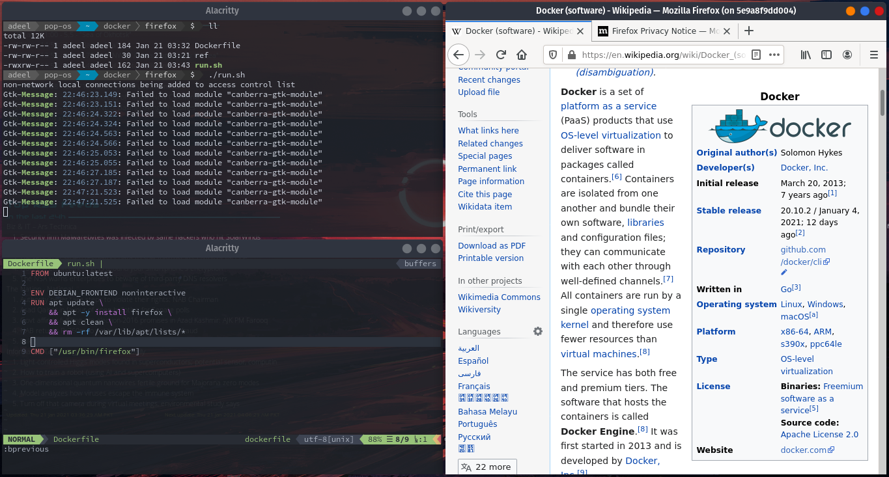
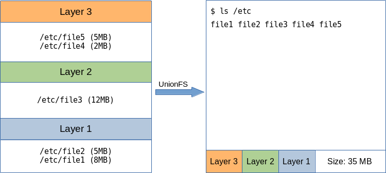
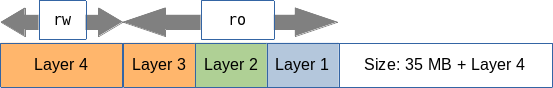
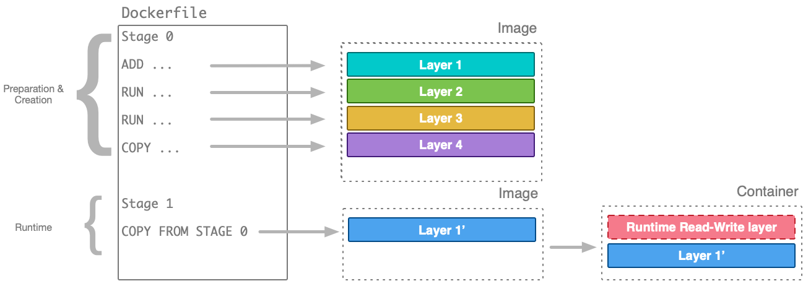

# Docker Command Reference 


## Contents

- [Docker Basics](#Docker-Basics)
    - [Docker Images](#Docker-Images)
    - [Container Life-cycle](#Container Life-cycle)
- [Dockerfile](#Dockerfile)
    - [Syntax](#Syntax)
    - [`.dockerignore` file](#-file)
    - [Instructions](#Instructions)
    - [Practices](#Practices)
- [Talking to the outside world](#Talking-to-the-outside-world)
    - [Network Ports](#Network-Ports)
- [Docker-Compose](#Docker-Compose)
- [Complementary Topics](#Complementary-Topics)
    - [Running GUI application in a container](#Running-GUI-application-in-a-container)
    - [Alpine Linux Commands](#Alpine-Linux-Commands)
    - [Image Analysis and Optimization](#Image-Analysis-and-Optimization)
        - [Image Layers](#Image-Layers)
        - [Build Path](#Build-Path)
        - [Normalize Layers](#Normalize-Layers)
        - [Delete Caches](#Delete-Caches)
        - [Base Image](#Base-Image)
        - [Build from Scratch](#Build-from-Scratch)
        - [Multi-Stage Builds](#Multi-Stage-Builds)
- [References](#References)


[Top](#Docker-Command-Reference) [Next>](#Dockerfile)

## Docker Basics

### Docker Images


#### Pull from Docker Hub

```sh
docker image pull alpine:latest
```

#### Delete images

```sh
docker image rm testImage
docker image rm 095cf376b73a
```

#### Contents of a Docker image

```sh
docker image inspect alpine | less
```

There is a lot of information, so it can be confusing, but as an example look for the values for `Cmd` and `Env` meta-data. To check the required tags in the JSON output use:

```sh
docker image inspect alpine --format '{{.ContainerConfig.Cmd}}'
docker image inspect alpine --format '{{.ContainerConfig.Env}}'
```

#### Create a tag

We can define as many tags as we want for docker images in our repository. In fact, a tag is a human-readable string aliases to the **IMAGE ID** hashes.

```sh
docker tag SOURCE_IMAGE[:TAG] TARGET_IMAGE[:TAG]
docker tag 1212d7ff8c47 sandbox:0.1
```


[< Prev](#Docker-Basics) [Top](#Docker-Command-Reference) [Next >](#Dockerfile)

### Container Life-cycle

#### Run interactively

Multiple containers can be created from an image, therefore a **container** is an **active image** with a unique name/identity. Run a container **i**nteractively and handover control in a **t**erminal as:

```sh
docker container run -it --name myAlpine alpine
```

You can now type Linux shell commands at the container shell prompt. Type `exit` to stop the container.

If you run an image not pulled (cached) already, docker first pulls it from the hub and then runs a container from it. For example

```sh
docker image rm -f alpine
docker run -it --name myAlpine alpine
```

#### Stop

To stop a running container

```sh
docker container stop myAlpine
```

#### List

To list running containers

```sh
docker container ls -a
# or
docker container ps -a
```

#### Inspect

Various parameters of a running container can be viewed using `inspect` command

```sh
docker container inspect --format '{{.State.Health.Status}}' myAlpine
```

#### Log

log command can show us the logs of running applications in a container

```sh
docker container logs myAlpine
```

#### Remove

Remove a container

```sh
docker container rm myAlpine
```

Remove all stopped containers

```sh
docker container rm $(docc ps -a -q)
```

Remove all exited containers

```sh
docker container rm $(docc ps -q -f status=exited)
```

#### Add aliases

Frequent commands can be shortened by adding aliases to `~/.bashrc` file like

```sh
alias doci="docker image"
alias docc="docker container"
```

#### Run detached

Run a container in detached mode with a command run definitely/indefinitely

```sh
docc run -d --name myAlpine alpine /bin/sh -c 'while echo $(( i += 1)) ; do sleep 5 ; done'
```

This image will keep running in detached mode, printing out integers to `stdout` every five seconds. To check the state of the container

```sh
docc inspect --format {{.State.Status}} myAlpine
docc ls
```

#### Start a stopped container

Start the stopped container in `attached` mode

```sh
docc start -a myAlpine
```

#### Execute commands in a container

We can even execute a new process in the container.

```sh
docc exec -it myAlpine /bin/sh
```

#### Run with remove on exit

If we don’t need to access to the container after it’s stopped we can pass the `--rm` option to `docc run ...`, for example:

```sh
docc run -d --rm --name myAlpine alpine

# you can specify a custom coomand/program to run in the container
# and --rm option if you don't want to keep the container.
docc run --rm -it --name myAlpine alpine:latest /bin/sh
# examples:
docker container run --rm -it --name ubuntu.test ubuntu:latest /bin/bash
docker container run --rm -it --name test alpine:latest /bin/sh -c 'echo $HOME'
```

#### List dangling images

```sh
doci ls --filter dangling=true
```

#### Remove dangling images/containers/networks/volumes

```sh
docker container prune
docker image prune
docker network prune
docker volume prune
```

[< Prev](#Docker-Basics) [Top](#Docker-Command-Reference) [Next >](#Talking-to-the-outside-world)

## Dockerfile

Contents of this section are mostly borrowed from docker docs topics [Dockerfile reference](https://docs.docker.com/engine/reference/builder/) and [Best practices for writing Dockerfiles](https://docs.docker.com/develop/develop-images/dockerfile_best-practices/). Hence, refer to these documents for a detailed explanation.

### Syntax


[< Prev](#Dockerfile) [Top](#Docker-Command-Reference) [Next >](#Practices)

### `.dockerignore` file


[< Prev](#Dockerfile) [Top](#Docker-Command-Reference) [Next >](#Practices)

### Instructions

#### `FROM`

#### `ADD`

#### `COPY`

#### `ENV`

#### `ARG`

The `ARG` instruction defines a variable that users can pass at build-time to the builder with the `docker build` command using the `--build-arg <varname>=<value>` flag. An `ARG` instruction can optionally include a default value, and if there is no value passed at build-time, the builder uses the default.

```dockerfile
FROM busybox
ARG user
USER ${USER:-user}
USER $USER
# ...
```

```sh
docker build --build-arg user=some_user .
```

An `ARG` instruction goes out of scope at the end of the build stage where it was defined. To use an arg in multiple stages, each stage must include the `ARG` instruction. An `ARG` instruction goes out of scope at the end of the build stage where it was defined. To use an arg in **multiple stages**, each stage must include the `ARG` instruction.

```dockerfile
FROM ubuntu
ARG SETTINGS
ARG CONT_IMG_VER
RUN ./run/setup $SETTINGS
ENV CONT_IMG_VER=${CONT_IMG_VER:-v1.0.0}
RUN echo $CONT_IMG_VER
# ...
FROM ubuntu
ARG SETTINGS
RUN ./run/setup $SETTINGS
```

#### `EXPOSE`

#### `LABEL`

#### `STOPSIGNAL`

#### `USER`

```dockerfile
USER <user>[:<group>]
```

or

```dockerfile
USER <UID>[:<GID>]
```

The `USER` instruction sets the user name (or UID) and optionally the user group (or GID) to use when running the image and for any `RUN`, `CMD` and `ENTRYPOINT` instructions that follow it in the `Dockerfile`.

Note that when specifying a group for the user, the user will have *only* the specified group membership. Any other configured group memberships will be ignored. When the user doesn’t have a primary group then the image (or the next instructions) will be run with the `root` group.

If a service can run without privileges, use `USER` to change to a non-root user. Start by creating the user and group in the `Dockerfile` with something like `RUN groupadd -r postgres && useradd --no-log-init -r -g postgres postgres`.

Users and groups in an image are assigned a non-deterministic UID/GID in that the “next” UID/GID is assigned regardless of image rebuilds. So, if it’s critical, you should assign an explicit UID/GID.

**Best Practices:** Avoid installing or using `sudo` as it has unpredictable TTY and signal-forwarding behavior that can cause problems. If you absolutely need functionality similar to `sudo`, such as initializing the daemon as `root` but running it as non-`root`, consider using [“gosu”](https://github.com/tianon/gosu). Lastly, to reduce layers and complexity, avoid switching `USER` back and forth frequently.

#### `VOLUME`

#### `WORKDIR`

```dockerfile
WORKDIR /path/to/workdir
```

The `WORKDIR` instruction sets the working directory for any `RUN`, `CMD`, `ENTRYPOINT`, `COPY` and `ADD` instructions that follow it in the `Dockerfile`. If the `WORKDIR` doesn’t exist, it will be created even if it’s not used in any subsequent `Dockerfile` instruction.

The `WORKDIR` instruction can be used multiple times in a `Dockerfile`.

The `WORKDIR` instruction can resolve environment variables previously set using `ENV`. You can only use environment variables explicitly set in the `Dockerfile`. For example:

```dockerfile
ENV DIRPATH=/path
WORKDIR $DIRPATH/$DIRNAME
RUN pwd
```

The output of the final `pwd` command in this `Dockerfile` would be `/path/$DIRNAME`.

**Best Practices:** For clarity and reliability, you should always use absolute paths for your `WORKDIR`. Also, you should use `WORKDIR` instead of proliferating instructions like `RUN cd … && do-something`, which are hard to read, troubleshoot, and maintain.

#### `ONBUILD`

#### `RUN`

#### `CMD`

#### `ENTRYPOINT`

#### `HEALTHCHECK`

#### `SHELL`


[< Prev](#Dockerfile) [Top](#Docker-Command-Reference) [Next >](#Talking-to-the-outside-world)

### Practices

#### Set shell aliases or functions for Docker containers

For interactive shells, by adding it to the user's `.bashrc`:

```dockerfile
FROM foo
RUN echo 'alias hi="echo hello"' >> ~/.bashrc
```

```sh
docker build -t test .
docker run -it --rm --entrypoint /bin/bash test hi
/bin/bash: hi: No such file or directory
docker run -it --rm test bash
user@container $ hi
hello
```

For non-interactive shells you should create a small script and put it in your path, like:

```dockerfile
RUN echo -e '#!/bin/bash\necho hello' > /usr/bin/hi && \
    chmod +x /usr/bin/hi
```

If your alias uses parameters (ie. `hi Joe` -> `hello Joe`), just add `"$@"`:

```dockerfile
RUN echo -e '#!/bin/bash\necho hello "$@"' > /usr/bin/hi && \
    chmod +x /usr/bin/hi
```

```sh
docker build -t test .
docker run -it --rm --entrypoint /bin/bash test hi Joe
hello Joe
```

#### Using `gosu` vs USER

`Dockerfile`s are for creating images. Use `gosu` as part of a container initialization when you can no longer change users between run commands in your `Dockerfile`.

After the image is created, something like `gosu` allows you to drop `root` permissions at the end of your `entrypoint` inside of a container. You may initially need `root` access to do some initialization steps (fixing uid's, host mounted volume permissions, etc). Then once initialized, you run the final service without `root` privileges and as `pid` 1 to handle signals cleanly.

Refer to [Docker: using gosu vs USER](https://stackoverflow.com/questions/36781372/docker-using-gosu-vs-user#37931896) discussion on stack overflow with [jenkins docker image](https://github.com/bmitch3020/jenkins-docker) example.

```sh
  # Add call to gosu to drop from root user to jenkins user
  # when running original entrypoint
  set -- gosu jenkins "$@"
```

Check example scripts at [Yogeek's GitHub gist](https://gist.github.com/yogeek/bc8dc6dadbb72cb39efadf83920077d3).

To install `gosu` in a docker image with `Dockerfile`:

```dockerfile
RUN set -x \
  && curl -sSLo /usr/local/bin/gosu "https://github.com/tianon/gosu/releases/download/$GOSU_VERSION/gosu-$(dpkg --print-architecture)" \
  && curl -sSLo /usr/local/bin/gosu.asc "https://github.com/tianon/gosu/releases/download/$GOSU_VERSION/gosu-$(dpkg --print-architecture).asc" \
  && export GNUPGHOME="$(mktemp -d)" \
  && gpg --keyserver ha.pool.sks-keyservers.net --recv-keys B42F6819007F00F88E364FD4036A9C25BF357DD4 \
  && gpg --batch --verify /usr/local/bin/gosu.asc /usr/local/bin/gosu \
  && rm -r "$GNUPGHOME" /usr/local/bin/gosu.asc \
  && chmod +x /usr/local/bin/gosu \
  && gosu nobody true
```

**Hint:** `gosu nobody true` is a smoke test to verify that the downloaded/installed binary is working appropriately. [[GitHub: tianon/gosu]](https://github.com/tianon/gosu/issues/61#issuecomment-486837963)

#### User/Group management in Alpine Linux image

For production setup, we can add a user/group with ID matching that on the production machine. In most Unix-like systems first user/group ID is 1000. Hence we can add a group & a user with GID/UID set to 1000.

```dockerfile
RUN addgroup -g 1000 lemp && adduser -u 1000 -G lemp -g lemp -s /bin/sh -D lemp
RUN chown lemp:lemp /var/www/html
```


[< Prev](#Dockerfile) [Top](#Docker-Command-Reference) [Next >](#Docker-Compose)

## Talking to the outside world

Containers live in an isolated world and changes made to them are not persistent until they are provided means to converse with the outside world. Generally, following are the means to transfer the information in and out of a container:

- Network Ports
- Bind Mounts
- Volume Mounts
- Passing environment variables at startup
- Writing container logs

### Network Ports

Port Mapping allows a container to expose a network end point by publishing a port in the Docker container to a port on the Docker host.

For example, listening port 8080 of a **Flask** *REST API* can be exposed outside the container and  mapped on port 8080 of the Docker host as

```sh
docc run -p 8080:8080 -d --rm --name api flaskapp:1.0
```

Status of the API container (running as a service) can be `inspect`ed as

```sh
docc inspect --format '{{.State.Health.Status}}' api
```

A normally running container will return a `healthy` status. Application log can be seen with this command

```sh
docc logs api
```

This will reveal AP logs of incoming requests and respective  responses.

[< Prev](#Talking-to-the-outside-world) [Top ](#Docker-Command-Reference) [Next >](#Complementary-Topics)

## Docker-Compose


[< Prev](#Talking-to-the-outside-world) [Top](#Docker-Command-Reference) 

## Complementary Topics


### Running GUI application in a container

The main use-case for containers are servers, daemons and applications run in headless mode. They are mostly used to develop and deploy applications. However, containers can also be used to run desktop (GUI) applications in a sandbox. The key to this use-case is the X server running on the host operating system. We need to allow an X client to connect to the host X server to display its GUI on host's display. This is achieve by using `docker run` options `-e` (environment variable) and `-v` (volume). Here, we pass `$DISPLAY` variable from host shell with `-e` and mount host's X server socket from host to the container as a shared volume with `-v`. Finally, we need to allow non-network local connections to the host's X server. This is achieved by updating access control list using `xhost` command. [[Ref# 5,6](#References)]

We build a container for **Firefox browser** from an `ubuntu:latest` image. The `Dockerfile` looks like:

```dockerfile
FROM ubuntu:latest

ARG DEBIAN_FRONTEND=noninteractive
RUN apt update \
    && apt-get -q -y install firefox \
    libcanberra-gtk-module \
    libcanberra-gtk3-module \
    && apt-get clean \
    && rm -rf /var/lib/apt/lists/*

CMD ["/usr/bin/firefox"]
```

To build the image, run:

```sh
docker build -t browser-box .
```

to run this container we use following script:

```sh
#!/usr/bin/env sh

xhost + local:root
docker run --rm -it --name firefox -e DISPLAY -v /tmp/.X11-unix:/tmp/.X11-unix:ro browser-box
xhost - local:root
```

and viola!



#### Display Size

Sometimes, the display size from Docker container is not ideal. We could set the display size using environment variables `DISPLAY_WIDTH` and `DISPLAY_HEIGHT`.

```sh
docker run -it --rm --name firefox -e DISPLAY=$DISPLAY -e DISPLAY_WIDTH=3840 -e DISPLAY_HEIGHT=2160 -v /tmp/.X11-unix:/tmp/.X11-unix browser-box
```


[< Prev](#Docker-Compose) [Top](#Docker-Command-Reference) 

### Alpine Linux commands

Since Alpine is based on BusyBox, its commands (e.g. `adduser` and `addgroup`) are different from full-scale Linux shells like bash, zsh etc.

#### User management

Users & groups are frequently added to a docker container build for a variety of reasons. Options for `adduser` command are:

```sh
Usage: adduser [OPTIONS] USER [GROUP]

Create new user, or add USER to GROUP

        -h DIR          Home directory
        -g GECOS        GECOS field
        -s SHELL        Login shell
        -G GRP          Group
        -S              Create a system user
        -D              Don't assign a password
        -H              Don't create home directory
        -u UID          User id
        -k SKEL         Skeleton directory (/etc/skel)
```

For `addgroup`:

```sh
Usage: addgroup [-g GID] [-S] [USER] GROUP

Add a group or add a user to a group

	-g GID	Group id
	-S	Create a system group
```

To change password:

```sh
Read user:password from stdin and update /etc/passwd

	-e,--encrypted		Supplied passwords are in encrypted form
	-m,--md5		Encrypt using md5, not des
	-c,--crypt-method ALG	des,md5,sha256/512 (default sha512)
	-R,--root DIR		Directory to chroot into
```

An usage example of these commands in a `Dockerfile` is as follows:

```dockerfile
FROM alpine:latest

# Create a group and user
RUN addgroup -S appgroup && adduser -S appuser -G appgroup

# Tell docker that all future commands should run as the appuser user
USER appuser
```

another example:

```dockerfile
FROM alpine:latest

# Create a group and user
RUN addgroup \
    -S -g 1000 \
    git && \
  adduser \
    -S -H -D \
    -h /data/git \
    -s /bin/bash \
    -u 1000 \
    -G git \
    git && \
  echo "git:$(dd if=/dev/urandom bs=24 count=1 status=none | base64)" | chpasswd
```


[<Prev](#Running-GUI-application-in-a-container) [Top](#Docker-Command-Reference) [Next >](#References)

### Image Analysis and Optimization

Useful tools for image analysis and optimization:

- [dive](https://github.com/wagoodman/dive)
- [DockerSlim](https://dockersl.im/)

#### Image Layers

A docker image is stacked-up files to be instantiated as a running container. Docker utilizes the Union File System (*UnionFS*) which groups files as layers. Each layer may contain one or more files and every layered on top of the previous layer. The virtual runtime merge of these layers results in a unified file system.



The final file system view presented to the user by the underlying implementation of *UnionFS* (via [docker's pluggable storge drivers](https://docs.docker.com/storage/storagedriver/select-storage-driver/)) has the total size of all layers collectively. When docker builds an image, it uses all the layers in a read-only format adding a thin read-write (rw) layer on top of them. This rw-layer allows us to modify files in a running container.



A file deleted from the container will not appear in the file system, however the size it occupied will still be the part of the container's footprint for it was included in a lower read-only layer. It's easy to start with a slim app binary and end up with a fat container image. In the following sections we'll take a look at some methods of analysis and optimization to keep our images as slim as possible.

#### Build Path

We should keep in mind that a Docker build is a client-server process. The Docker CLI (client), where we execute the `docker build` command from, uses the underlying Docker engine (server) to build a container image. To restrict access to the underlying file system of the client, the build process needs to know what the virtual file system root is and where the commands in your `Dockerifle` should try to find file resources to place in the image being built. If we carelessly define an `ADD`/`COPY` command in the `Dockerfile`, all those files can be part of the final image. Most of the time, this is not what we need as only a few selected project artefacts should be included in the final container image.

```sh
docker build .
```

If for any reason you really need to define the root of your project as the build context, you can selectively include/exclude files via `.dockerignore`. The CLI interprets the `.dockerignore` file as a newline-separated list of patterns similar to the file globs of Unix shells. If a line in `.dockerignore` file starts with `#` in column 1, then this line is considered as a comment and is ignored before interpreted by the CLI. 

This file causes the following build behavior:

| Rule        | Behavior                                                     |
| :---------- | :----------------------------------------------------------- |
| `# comment` | Ignored.                                                     |
| `*/temp*`   | Exclude files and directories whose names start with `temp` in any immediate subdirectory of the root. For example, the plain file `/somedir/temporary.txt` is excluded, as is the directory `/somedir/temp`. |
| `*/*/temp*` | Exclude files and directories starting with `temp` from any subdirectory that is two levels below the root. For example, `/somedir/subdir/temporary.txt` is excluded. |
| `temp?`     | Exclude files and directories in the root directory whose names are a one-character extension of `temp`. For example, `/tempa` and `/tempb` are excluded. |

For details, check [Dockerfile reference documentation](https://docs.docker.com/engine/reference/builder/#dockerignore-file).

#### Normalize Layers

The maximum number of layers an image can have is 127, provided your underlying storage driver supports it. This limit can be increased, if really needed, with Docker engine running on a similarly modified underlying Kernel. As discussed earlier, whatever file resource goes into a layer stays in the layer even if you `rm` that file in a subsequent layer. Therefore, we need to avoid and/or get rid of the wasted spaces.

##### Command merge

It's when a `Dockerfile`  is written with an extremely long `RUN` directive where multiple shell commands are aggregated with `&&`. By merging commands, we essentially create a single layer out of the result of this single long command. As each `RUN` directive adds a layer to the image.

##### Squashing the image

An alternative approach especially when using someone else’s `Dockerfile` that you don’t want or can’t modify, is to build your image with Docker’s `--squash` command. It's available for all **Docker versions >= 1.13**.

```sh
docker build --squash .
```

However, remember that squashing your layers may prevent you or the users of your image from taking advantage of previously cached layers. You may use a tool [dive](https://github.com/wagoodman/dive) to check the final efficiency of the image.

#### Delete Caches

often when we containerize an application, we need to make extra tools, libraries, or utilities available on the image we build by using a package manager such as `apk`, `yum`, or `apt`. This leaves us a cache of fetched packages. To keep the size of our resulting Docker image as small as possible, we need to remove this package cache in a command merge.

```sh
# in case of a Debian/Ubuntu base image
apt-get clean && rm -rf /var/lib/apt/lists/*
# in case of a Red Hat/CentOS base image
rm -rf /var/cache/yum
# in case of an Alpine base image
rm -rf /tmp/* /var/cache/apk/*
```

#### Base Image

There are a lot of different base images to choose from, each one with its own perks and features. Choosing an image which provides just enough of the tools and the environment you need for your application to run is of paramount importance when it comes to the final size of your own Docker image.

| **Image Type**        | **Alpine** | **CentOS**     | **Debian**     | **Debian Slim** | **Fedora**     | **UBI**        | **UBI Minimal** | **UBI Micro**  | **Ubuntu LTS** |
| --------------------- | ---------- | -------------- | -------------- | --------------- | -------------- | -------------- | --------------- | -------------- | -------------- |
| **Version**           | **3.11**   | **7.8**        | **Bullseye**   | **Bullseye**    | **31**         | **8.2**        | **8.2**         | **8.2**        | **20.04**      |
| **Architecture**      |            |                |                |                 |                |                |                 |                |                |
| C Library             | muslc      | glibc          | glibc          | glibc           | glibc          | glibc          | glibc           | glibc          | glibc          |
| Package Format        | apk        | rpm            | dpkg           | dpkg            | rpm            | rpm            | rpm             |                | dpkg           |
| Dependency Management | apk        | yum            | apt            | apt             | dnf            | yum/dnf        | yum/dnf         | yum/dnf        | apt            |
| Core Utilities        | Busybox    | GNU Core Utils | GNU Core Utils | GNU Core Utils  | GNU Core Utils | GNU Core Utils | GNU Core Utils  | GNU Core Utils | GNU Core Utils |
| Compressed Size       | 2.7MB      | 71MB           | 49MB           | 26MB            | 63MB           | 69MB           | 51MB            | 12MB           | 27MB           |
| Storage Size          | 5.7MB      | 202MB          | 117MB          | 72MB            | 192MB          | 228MB          | 140MB           | 36MB           | 73MB           |

Source: [Crunchtools](http://crunchtools.com/comparison-linux-container-images/#Comparison_of_Images)

Before choosing Alpine as your default base image, you should check if it provides all the environment you need. Also, even though Alpine comes with a package manager, you may find that a specific package or package version you’re using in your (for instance) Ubuntu-based development environment isn’t available in Alpine. These are trade-offs you should be aware of and test before you choose the most appropriate base image for your project.

Finally, if you really need to use one of the fatter base images, you could use an image minimization tool, such as the free and open source [DockerSlim](https://dockersl.im/), to still reduce the size of your final image. 

#### Build from Scratch

If you have an application that can run without any additional environment provided by a base image, you can opt to not use a base image at all. Of course, since `FROM` is mandatory in a `Dockerfile`, you must still have it and point it to something. For this we have `FROM Scratch`, *which is a no-op in the Dockerfile, and will not create an extra layer in your image*. If your application consists of self-contained executables that can operate in a standalone fashion, choosing the `scratch` base image allows you to minimize the footprint of your container as much as possible. 

#### Multi-Stage Builds

A multi-stage build allows image builders to leave custom image build scripts behind and integrate everything into the well-known `Dockerfile` format. you can think of a multi-stage build as merging multiple `Dockerfiles` together, or simply a `Dockerfile` with multiple `FROM`s. Although there is nothing technically wrong with the vintage process, the final image and the resulting container are bloated with layers created while building/preparing the project artifact that are not necessary for the project’s runtime environment.

Multi-stage builds allow you to separate the creation/preparation phases from the runtime environment



You can still have a single `Dockerfile` to define your complete build workflow. However, you can copy artifacts from one stage to another while discarding the data in layers you don’t need.

Multi-stage builds allow you to create cross-platform, repeatable builds without using OS-specific, custom build scripts. The final size of your image can be kept to a minimum by selectively including artifacts generated in previous phases of your build.

[<Prev](#Alpine-Linux-commands) [Top](#Docker-Command-Reference)

## References

1. Docker docs
2. Dockerfile reference
3. Dockerfile best practices
4. Docker compose reference
5. Lei Mao's [log book](https://leimao.github.io/blog/Docker-Container-GUI-Display/).
6. [linuxmeerkat](https://linuxmeerkat.wordpress.com/2014/10/17/running-a-gui-application-in-a-docker-container/) blog.

[<Prev](#Image-Analysis-and-Optimization) [Top](#Docker-Command-Reference)